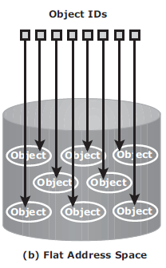
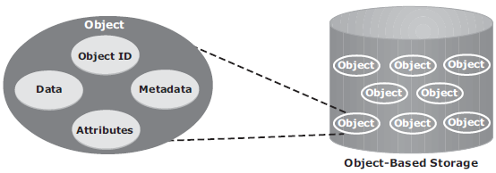

# Chapter 8

### 1. Explain the advantage of a flat address space over a hierarchical address space.

### 
Easy, Peezy! Check out this picture:

As you can see here, in a Flat Address Space setting, data is stored in the form of objects. OSD or Object-based storage uses flat address space to store unstructured data because it easy to organize and manage. When data is stored as objects, there is no hierarchy. This means that it is very easy, fast, and efficient to address each object, which is done via object IDs.

When it comes to a hierarchical address space, as it is mentioned in the name, you need to go through a hierarchy. This means what? → LATENCY BABY!!! This is a big no-no. When it comes to data, you never want latency. Users tend to get upset when their web page doesn't load up within 6 seconds, imagine if they were watching a movie on Netflix! Those types of media files are all unstructured!

### 2. Explain the use of metadata.

First of all, here is the definition of:

    Metadata - Data about data that describes the characteristics of data
    such as content, quality, and condition.

### 
Within an object is the following:

The OSD has two services, storage and metadata. The metadata service generates the object ID from the contents / attributes of the data within a file. It also maintains the mapping of the object IDs and the file system namespace.

### 3. Explain the key features of content-addressed storage (CAS).

* Content authenticity: 
    * The stored content is always genuine since there is unique content address for each object. Content addresses for stored objects are validated at regular intervals. Every time an object is read, CAS
    uses a hashing algorithm to recalculate the object’s content address as a
    validation step and compares the result to its original content address.
* Content integrity: 
    * It provides assurance that the stored content has not
    been altered. CAS uses a hashing algorithm for content authenticity and
    integrity. If the fixed content is altered, CAS generates a new address for
    the altered content, rather than overwrite the original fixed content.
* Location independence: 
    * CAS uses a unique content address, rather than directory path names or URLs, to retrieve data. This makes the physical location of the stored data irrelevant to the application that requests the data.
* Single-instance storage (SIS): 
    * CAS uses a unique content address to guarantee the storage of only a single instance of an object. When a new object is written, the CAS system is polled to see whether an object is already available with the same content address. If the object is available in the system, it is not stored;instead, only a pointer to that object is created.
* Retention enforcement: 
    * Protecting and retaining objects is a core requirement of an archive storage system. After an object is stored in the CAS system and the retention policy is defined, CAS does not make the object available for deletion until the policy expires.
* Data protection: 
    * Provides both local and remote protection to the data objects stored on it. In the local protection option, data objects are either mirrored or parity protected. In the remote replication option, data objects are copied to a secondary CAS at the remote location. In this case, the objects remain accessible from the secondary CAS if the primary CAS system fails.
* Fast record retrieval: 
    * CAS stores all objects on disks, which provides faster
    access to the objects compared to tapes and optical discs.
* Load balancing: 
    * CAS distributes objects across multiple nodes to provide maximum throughput and availability.
* Scalability: 
    * CAS allows the addition of more nodes to the cluster without any interruption to data access and with minimum administrative overhead.
* Event notification: 
    * CAS continuously monitors the state of the system and raises an alert for any event that requires the administrator’s attention. The event notification is communicated to the administrator through SNMP, SMTP, or e-mail.
* Self-diagnosis and repair: 
    * CAS automatically detects and repairs corrupted objects and alerts the administrator about the potential problem. CAS systems can be configured to alert remote support teams who can diagnose and repair the system remotely.
* Audit trails: 
    * CAS keeps track of management activities and any access or disposition of data. Audit trails are mandated by compliance requirements.

### 4. Explain the key components of unified storage.
* Storage Controller:
    * Provides block-level access to servers via iSCSI, FC, or FCoE protocols... It is also responsible for managing the back-end storage pool in the storage system.
* NAS head:
    * Dedicated file server which provides file access to NAS clients. It's connected to storage via storage controller via FC/FCoE connection. There are multiple NAS heads for redundancy.
* OSD node:
    * Accesses storage through storage controller via FC/FCoE connection. LUNs assigned to OSD node show up as physical disks are configured by these nodes.
* Storage:
    * Storage is self-explanitory, disks and other storage devices...