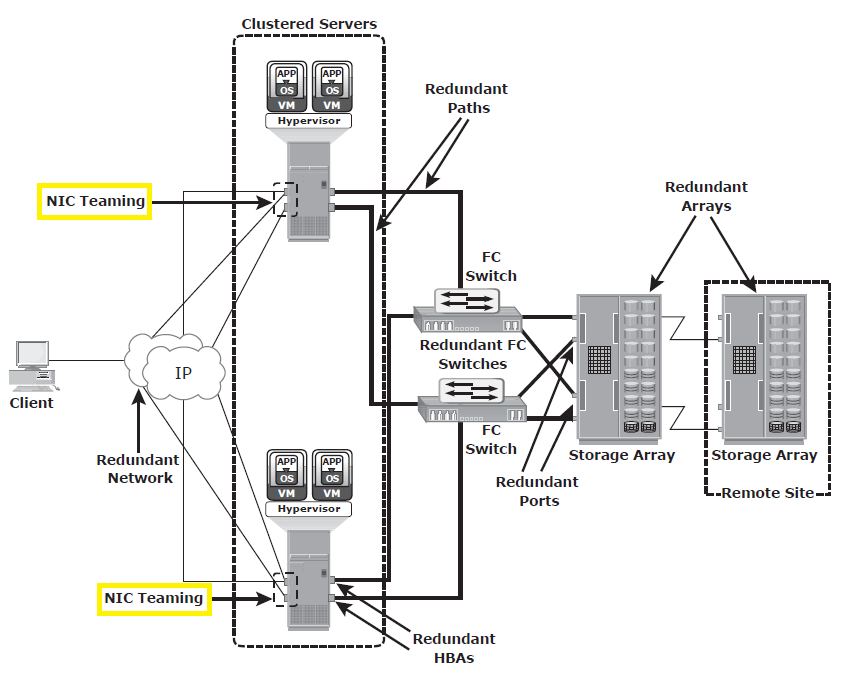

# Chapter 9

### 1. Explain recovery-point objective (RPO).  Give me an example of how it is used.
 - An RPO is the point in time to which a system and it's data needs to be recovered after the business experiences an outage. It will also define some kind of value to represent the actual amount of data loss that the business can endure without going belly up. The larger the RPO, the higher the tolerance of information loss in a business. An RPO also determines how often data is backed up/replicated. 
 
 - Well, the better the RPO, the more $$$ it costs. For example, Facebook is a company who cant afford data loss since ALL of earning comes from data brokerage. Therefore their RPO will be an exceptionally small amount of time, most likely measured in minutes, if not seconds!
### 2. Explain recovery-time objective (RTO).  Give me an example of how it is used.
- An RTO os the point in time to which a system and it's applications need to be recovered after the business experiences an outage. It will also define some kind of value to represent the actual amount of downtime that the business can endure without going belly up. The better defined the RTO, the more optimized the disaster recovery process in a business. Similar to an RPO, an RTO also determines how often data is backed up/replicated. 

- Similar to an RPO, the better the RTO, the more $$$ it costs. For example, Netflix is a company whose customers need to have constant access to their favorite shows. Since Netflix has the trust of their customers who expect to constantly be fed televised garbage, they need to have virtually no downtime. Therefore, similar to Facebook's RPO, Netflix's RTO will be an exceptionally small amount of time, most likely measured in minutes, if not seconds!
### 3. What is the formula to measure information availability?  Give me an example of how it is used.
Information Availability can be determined via the following formula:
> IA = system uptime/(system uptime + system downtime)

- Well, lets says that out of 100 days, the system is up for 98 days and down for 2 days. information availability will be calculated like this:
> IA = 98 days (system uptime) / 98 days + 2 days (system uptime + system downtime)

> IA = 98 days (system uptime) / 100 days (system uptime + system downtime)

> IA = .98 or 98%

This means that, in this system, information is available 98 percent of the time.
### 4. What is NIC teaming?  Give me an example of how it is used.
- NIC teaming is the practice of taking two or more physical NICs and concatenating them into one logical device. This way, other NICs can pick up the slack if one fails.

- NIC teaming can be used to eliminate SPOF if you use it on a server running a HyperVisor and allow IP traffic to route through these NICs. This way, even if a particular NIC were to fail, the others would still be able to keep function ongoing.

